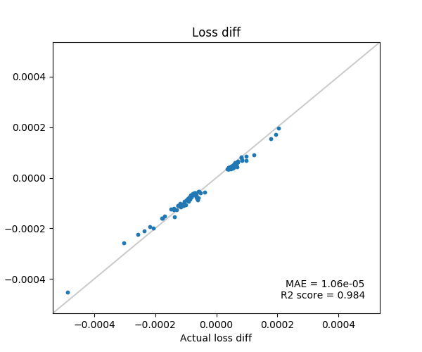

# influence_function_with_lissa
LiSSA Influence Function implementation by tensorflow

# What is this?
A simple implementation of a paper [**Understanding Black-box Predictions via Influence Functions**](https://arxiv.org/abs/1703.04730)


# Usage
```bash
$ python demo.py
```
